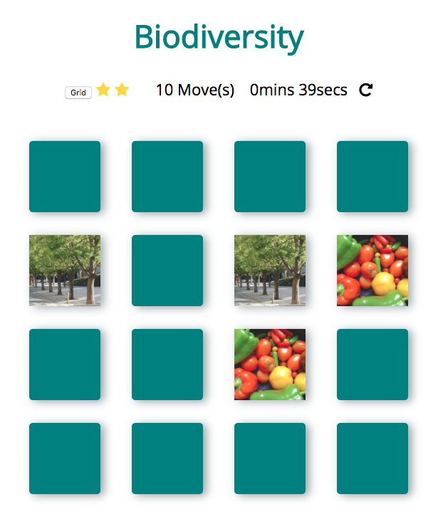

# Memory Game Project

This repository was forked from sandraisrael's memory game project. Modals were added after matched cards and theme colors were changed.

## What is the Memory Game
This is a simple game built to test a users memory. There's a deck of cards with different icons.

## Challenge
Match cards in less time with less moves.

## How to Play
Clone this repository and open a local server on localhost:8000;

## Instructions
* Click on a card
* Keep revealing cards and working your memory to remember each unveiled card.
* Match cards properly with less moves and in faster time

## How I built the Memory Game (sandraisrael)
I manipulated the DOM with Vanilla JS, altered part of the HTML and also styled the game
* created a deck of cards that shuffles when game is refreshed
* created a counter to count the number of moves made by player and timer to know the duration of a play
* added effects to cards when they match and are unmatched
* create a pop-up modal when player wins game

## How I changed the Memory Game (tlindow)
* changed the theme colors and fonts
* created a pop-up modal (with content) when the player matches cards

## To Do's
* Get rid of grid button for now
* Use grid button functionality to create larger/smaller grids
* Create an obvious reset button for testing on the floor
* Create an attract/get started screen
* Update background and main header
* Create a pop up for more emoji selections (could be similar to Facebook's liking)
